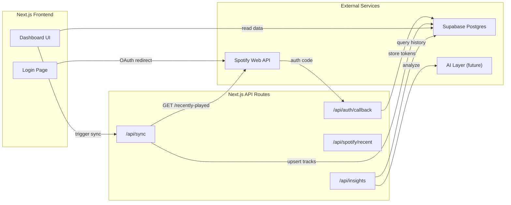

# Music Intelligence Dashboard

## Architecture

## Supabase Schema

Four tables to normalize the data:

- **artists** — `id (uuid)`, `spotify_id (text, unique)`, `name`, `image_url`, `genres (text[])`
- **tracks** — `id (uuid)`, `spotify_id (text, unique)`, `name`, `album_name`, `album_image_url`, `duration_ms`, `preview_url`, `popularity`
- **track_artists** — `track_id (fk)`, `artist_id (fk)` (junction table)
- **listening_history** — `id (uuid)`, `track_id (fk)`, `played_at (timestamptz, unique)`, `context_type`, `context_uri`

The `played_at` uniqueness constraint prevents duplicate history entries on re-sync.

## Tech Stack

- **Framework**: Next.js 14 (App Router)
- **Styling**: Tailwind CSS
- **Database**: Supabase (Postgres + JS client)
- **Auth**: Spotify OAuth 2.0 (Authorization Code flow) via Next.js API routes
- **Charts**: Recharts (lightweight, React-native)
- **AI (future)**: OpenAI / Anthropic API via `/api/insights`

## Phases

### Phase 1 — Project Setup and Supabase Schema

- Initialize Next.js project with TypeScript and Tailwind
- Create Supabase tables (artists, tracks, track_artists, listening_history)
- Add Row Level Security policies
- Set up environment variables (Spotify client ID/secret, Supabase URL/key)

**Files**: `package.json`, `.env.local`, Supabase migration SQL, `src/lib/supabase.ts`

### Phase 2 — Spotify OAuth Flow

- Implement `/api/auth/login` — redirects user to Spotify authorize URL with scopes: `user-read-recently-played`
- Implement `/api/auth/callback` — exchanges auth code for access/refresh tokens, stores in HTTP-only cookie or Supabase
- Implement `/api/auth/refresh` — refreshes expired tokens
- Build a login page with "Connect Spotify" button

**Files**: `src/app/api/auth/login/route.ts`, `src/app/api/auth/callback/route.ts`, `src/app/page.tsx`

### Phase 3 — Data Sync Pipeline

- Implement `/api/spotify/recent` — calls Spotify's `GET /v1/me/player/recently-played?limit=50`
- Implement `/api/sync/route.ts` — fetches recent tracks, upserts artists/tracks/history into Supabase
- Deduplicate on `played_at` timestamp to avoid re-inserting on repeated syncs
- Token refresh handled automatically when access token expires

**Files**: `src/app/api/sync/route.ts`, `src/lib/spotify.ts`

### Phase 4 — Dashboard UI

- **Listening Feed**: chronological list of recently played tracks with album art, artist, time
- **Stats Cards**: total unique tracks, top artist, total listening time
- **Top Artists Chart**: bar chart of play counts by artist (from stored history)
- Auto-sync on page load (with loading states)

**Files**: `src/app/dashboard/page.tsx`, `src/components/TrackCard.tsx`, `src/components/StatsBar.tsx`

### Phase 5 — AI Insights (future, not built now)

- `/api/insights` route queries listening_history, sends to LLM
- Returns personalized observations (e.g., "You listen to more jazz after 10pm")
- Placeholder UI section on dashboard

## Risks / Edge Cases

- **Spotify rate limits**: 429 responses — need retry with `Retry-After` header
- **Token expiry**: access tokens last 1 hour; must refresh silently
- **Recently played limit**: Spotify only returns last 50 tracks per call. Frequent syncing is needed to build a complete history over time
- **Duplicate prevention**: `played_at` is unique per listen, but Spotify may return the same `played_at` across calls — upsert with `ON CONFLICT DO NOTHING`
- **Supabase MCP**: The Supabase MCP server is not yet authenticated. Schema creation can be done via SQL in the Supabase dashboard or by authenticating the MCP first

## Implementation Order

Work will proceed phase by phase. Each phase will touch at most 5 files per task, per the project rules. Phase 5 (AI) is deferred — the schema and API structure are designed to support it when ready.